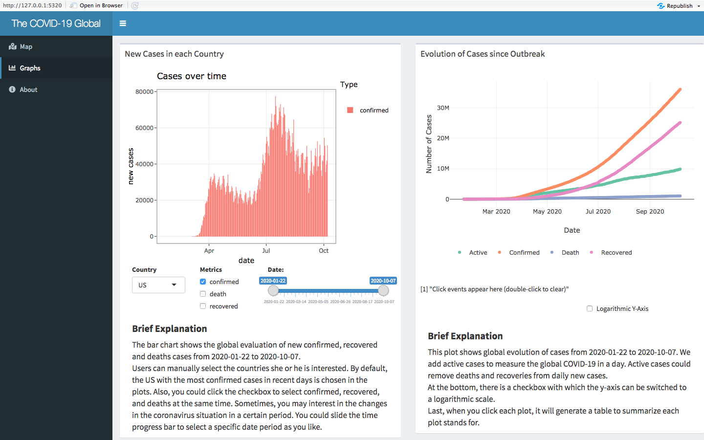

The novel coronavirus has been an unavoidable topic for several months. This coronavirus outbreak was first documented in Wuhan, Hubei Province, China in December 2019. These were caused by a new type of coronavirus, and the disease is now commonly referred to as COVID-19. The number of COVID-19 cases started to escalate more quickly in mid-January, and the virus soon spread beyond China’s broad. As of writing this, it has now been confirmed on six continents and in more than 100 countries. 
As a business analytics student, I will try my best to approach the recent COVID-19 pandemic from a data perspective. Therefore, I create a dashboard to track and visualize the spread of COVID-19. You can find the R Shiny dashboard I created [here](https://yawen.shinyapps.io/shiny-assessment-yawenzhang9701/). 


## Brief Introduction `r emo::ji("camera_flash")`

This coronavirus shiny app provides an overview of the 2019 Novel Coronavirus COVID-19 (2019-nCoV) epidemic. Since only look at the data, it is hard to interpret how fast is the virus spreading, and how does the situation in each country. Then, I created this dashboard to track and visualize the spread by providing several interactive plots and tables, including the timeline function and the ability to overlay past outbreaks. 
  
This blog post is an introduction of the Coronavirus Pandemic Shiny app, and mainly focus on reviewing the app and offer the points need to improve. By looking through this dashboard, I hope it is possible to get a deeper understanding of this pandemic. 

## Self Review

### What I did well? `r emo::ji("confused")`

This shiny app contains the interactive leaflet map, plots and the summarize table to track and visualize the spread of COVID-19. The dashboard is segmented into several sections that can be selected on the left side of the browser window. I will briefly talk about what I did well regarding this dashboard for each section. 

  
  - Map and table
  
  <center>
```{r map, echo=FALSE, out.width = '100%', fig.cap="COVID-19 Dashboard — Overview Map Section"}
knitr::include_graphics("map.png")
```
  </center>
  This map section (Refer to Figure \@ref(fig:map)) of the dashboard shows the world map and a list of countries with their respective number of confirmed, recovered and death cases. A time-lapse feature with a simple slider is included to get an idea on about the development of the pandemic. The start bottom at the lower right corner of the slider could help users in overview the dynamic changes. 
Within the leaflet map, I add a label of each point to the map to quickly determine the location for each country. Users could also choose the different types of data in the map by clicking the checkbox, which contains confirmed, recovered and deaths. 

  
  -	Graph
  <center>
```{r graph, echo=FALSE, out.width = '100%', fig.cap="COVID-19 Dashboard — Overview Graph Section"}

``` 
  </center>
  This graph section (Figure \@ref(fig:graph)) contains plots visualizing several interesting aspects of the COVID-19 pandemic progression with a brief explanation. 
In the left graph, users have the ability to manually select the countries and different type of variables such as confirmed, deaths, recovered she or he interested in. 
The second graph on the right shows the global evolution of cases from 2020-01-22 to 2020-10-07. I add active cases to measure worldwide COVID-19. Active cases could remove deaths and recoveries from daily new cases.  This plot has a checkbox with which the y-axis can be switched to a logarithmic scale.   
  Both two graphs have transferred to plotly, which makes it easy to create interactive data visualization. 
  
  -	About

    The dashboard is rounded off with the “About” section, which briefly describes the motivation, data sources and additional information on the creator, which gives users a brief background of this shiny app. 
  
### What can I improve on? `r emo::ji("dizzy_face")`

  -	In the map section, a separate tab called province and state could add in the table beside the country. To better understanding, refer to Figure \@ref(fig:tab). Also, connect the table with the timeline.
  
  <center>
```{r tab, echo=FALSE, out.width = '80%', fig.cap="Improve in Adding Tab"}

```
  </center>  
  -	It may be more logical to swap the positions of the left and right graphs because we will review the global situation first, then observe the situation of each country. 
      
  -	The graph on the left needs to add one variable within the existing three metrics called active, which could be consistent with the variables on the right. Active cases could remove deaths and recoveries from daily new cases. It measures the daily epidemic situation more accurately. 
      
  -	Since the overall inspiration comes from the [John Hopkins Dashboard](https://coronavirus.jhu.edu/map.html), adding an acknowledgement part in the about section is necessary. It is courteous and ethical to let readers know that this dashboard had writing help and cooperation with other scholars in the development of my work. 
  
### Some things I'd like to add that is plausible `r emo::ji("raised_eyebrow")`

  -	The input data for this dashboard is from the R package; so far, the data is constantly updated. It will be more readable to add the link to read. As a result, daily cases can be updated directly. 
```
read.csv("https://raw.githubusercontent.com/RamiKrispin/coronavirus/master/csv/coronavirus.csv", stringsAsFactors = FALSE)
```
    
  -	By looking through other shiny app dashboards, adding several value boxes involves the amount of confirmed, recovered, death and active cases in a day could make data communication with users. 
  
### Some things I’d like to add that cannot be done yet due to limitation in data or technology `r emo::ji("face_with_head_bandage")`


  -	In the map section, all the coloured circles stand for countries is illogical. The format I want to display is some coloured circles stand for countries and some stand for provinces or states. 
    
    For example, you could expand the map, then move your mouse to these coloured circles in Australia and read the title in the label. At the bottom side of Australia, that circle should be Victoria instead of Australia (Refer to Figure \@ref(fig:teach)).  
    <center>
```{r teach, echo=FALSE, out.width = '100%', fig.cap="Problems in Map Section"}
knitr::include_graphics("map_fix.png")
```
  </center>
  This issue comes from the data processing steps, in the raw data, some countries have the number of cases both in the whole country and each state while others only have the number of causes related to that country.  However, continue to do in-depth data processing to separate states and countries is a challenging work for me.
      
  -	Although I connect the slider bar with the map and table, combining the DT table with the map is not in my ability. In my imagination, if I click one of the rows in DT table, the map will locate to that row I click directly no matter that row stands for countries or states. 
  
## Conclusion  
Overall, there are several areas I could improve on. Therefore, we create this shiny dashboard into an open-source version, and I could get feedback quickly. I appreciate all of you to contribute to this project with additional visualizations, information etc. If you find any bug/issue or have an idea on how to improve the dashboard, please create an issue on [GitHub](https://github.com/etc5523-2020/shiny-assessment-yawenzhang9701). I will try to look into it as soon as possible. From my dashboard, if it could help you to improve your skills and learn new things, it would be my pleasure. 


## Acknowledgements

One package used in this post is `knitr` [@knitr]. 
  
Thanks for `{coronavirus}` package `r emo::ji("package")` provided data [@package] and John Hopkins University Dashboard provide ideas for this shiny app [@university]


##  References


