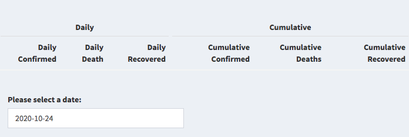

```{r setup, include=FALSE}
knitr::opts_chunk$set(echo = TRUE)
```

## Overview `r emo::ji("thumbsup")`
In this blog post I will be reviewing Mayunk Bharadwaj's R package `ozcovid` made for Assignment 2 of ETC5523 containing coronavirus data, functions, and shiny application. The development version from [GitHub](https://github.com/etc5523-2020/r-package-assessment-mayunk264/issues).

The goal of ozcovid is help user to explore Australia’s coronavirus data through the interactive Shiny application ‘Coronavirus in Australia’ and the dataset `oz_covid_data`. The package also contains three functions:  

- `launch_app()`: 

  The function allows the user to interact with Australia's coronavirus data by launching the shiny dashboard ’Coronavirus In Australia'. 
  
- `stateSelectInput()`:
  
  This function aims to select the state/territory of choice within the shiny app to generate a graph of confirmed coronavirus cases over time. This function generated from the ui components of the Shiny application
  
- `vicEventRenderText()`：
  
  This function generates a sentence describing the date and number of deaths in Victoria related to coronavirus on that date by asking the user to click on any point on the Victorian coronavirus-related deaths graphic. This function generated from the server components of the Shiny application. 
  
## What did I think this package would do? Did it do it? `r emo::ji("camera_flash")`

At the onset of viewing the GitHub page, the readme file, and pkgdown page using `pkgdown::built_site()` function in Rstudio, these materials gave a clear picture of the package. All the functions and data set inside the `ozcovid` package are relative to coronavirus in Australia. 

The `launch_app()` function is the centerpiece of the package. I can follow the steps in the readme file to run the shiny app. When executed, the function will return a Shiny application entitled ‘Coronavirus in Australia’. There are three main sections of the application:
  
-	Confirmed Cases by state: a simple line plot was displaying confirmed coronavirus cases by the state over time (Refer to Figure \@ref(fig:line)). 

  <center>
```{r line, echo=FALSE, out.width = '75%', fig.cap="the line plot in Shiny Dashboard"}
knitr::include_graphics("line.png")
```
  </center>
  
-	Coronavirus Summary Table: a table that displays daily and cumulative coronavirus confirmed cases, deaths, and recoveries by date (Refer to Figure \@ref(fig:table)). 

  <center>
```{r table, echo=FALSE, out.width = '75%', fig.cap="the table in Shiny Dashboard"}

```
  </center>
  
-	Deaths In Victoria: an interactive bar chart of Victoria’s coronavirus-related deaths (Refer to Figure \@ref(fig:bar)). 

  <center>
```{r bar, echo=FALSE, out.width = '75%', fig.cap="the bar chart in Shiny Dashboard"}
knitr::include_graphics("bar.png")
```
  </center>

In this shiny application, users have the ability to manually select or click the graph to achieve interactively and help users get an idea about the development of the pandemic. 

Furthermore, as described in the help file and vignette, I successfully used the  `oz_covid_data()` function to obtain the data in the application. Two functions `stateSelectInput()` and `vicEventRenderText()` may assist other users in generating their shiny application.

## Suggestions and Improvement `r emo::ji("open_book")`
### Are the improvements that could be made to the code? `r emo::ji("raised_back_of_hand")`

I think the code is well-written, and gives a concise and easy to understand documentation. However, I have two suggestions based on your code. 
  
First of all, add some arguments to your function. If a function without any argument when executed, it will generate some limitations, such as the function is not reproducible or meaningless. The existing two functions could only use in your shiny application, so there is no need to include an argument within the function. I would suggest adding a new function based on your repeating menu icon in the dashboard.

```
@export
add_menu <- function(id, text_name, icon_name){
  shinydashboard::menuItem(id, tabName = text_name, icon = icon(icon_name))
}
```
This function aims to add menu bar in the shiny dashboard. It contains three arguments: sidebar menu which be used for a Shiny input value, the name of a tab that this menu item will activate and the available icons.

In addition, the function with several arguments will be more complicated. You could add an example to tell users how to use this function. 

Here is an example: 

```
@examples
add_menu("Map", "Map", "map-marked-alt")
```
